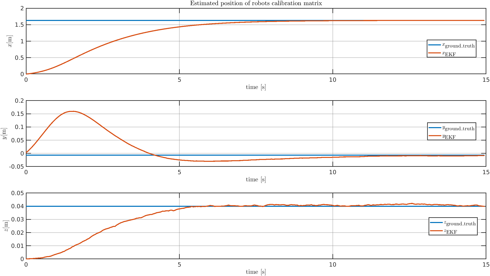
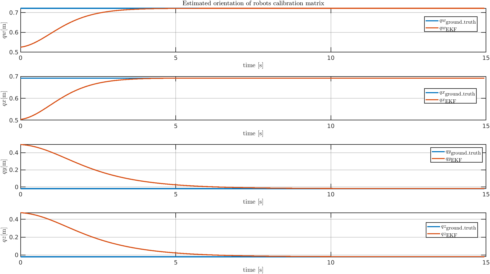

# Dual Arm Control

In this repository, you will find the code for the online calibration and control of a dual-arm robotic system. 

Regarding perception, the two manipulators, equipped with hand-eye mounted cameras, estimate the object's pose w.r.t. their base frame. An Extended Kalman Filter (EKF) uses these measurements, along with the forces measured by the robot grippers, to jointly estimate the object's pose (position and quaternion), in the common base frame, and the robots' relative pose.
The EKF can incorporate various measurements from the robots' cameras and handle potential occlusions. This ensures that the filter continues to function regardless of whether the poses are estimated using ArUco markers, deep learning-based 6DoF methods, or object trackers.

The following video shows the estimation result of the calibration matrix between robots when the object is stationary and the cameras capturing its pose
through ArUco markers detection. 

    

## Position Calibration

    

## Orientation Calibration

    

 

